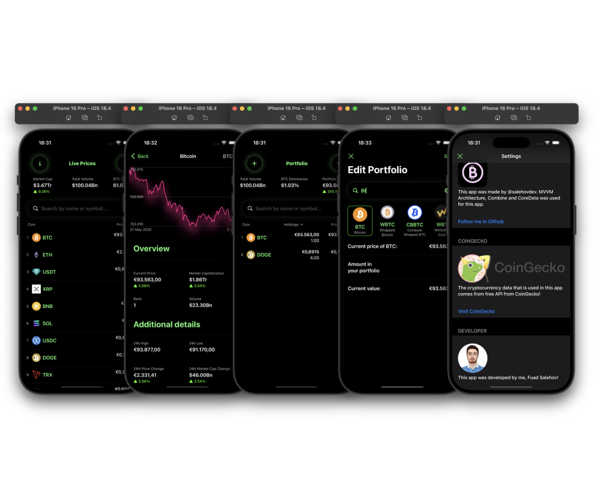

# 💰 CryptoTracker

CryptoTracker is a sleek and modern iOS app built using **SwiftUI** and **MVVM architecture**, designed to help users track real-time cryptocurrency data, manage their portfolio, and view detailed market statistics — all with smooth animations, a responsive UI, and local data persistence.

## 📱 Features

- 📊 Real-time Cryptocurrency Prices
- 💼 Portfolio Tracking: Add/remove coins to your personal portfolio
- 🧮 Beautiful Statistics View using `GeometryReader` and `Path`
- 💾 Persistent Storage with CoreData
- 💡 Saved Coins & Images using `FileManager`
- 🌐 Combine for reactive API calls
- ✨ Smooth Animations for transitions and state changes
- 🔔 Haptic feedback using a custom `HapticManager`

---

## 🧠 Tech Stack

| Layer        | Technology            |
|--------------|------------------------|
| UI           | SwiftUI                |
| Architecture | MVVM (Model-View-ViewModel) |
| Networking   | Combine                |
| Persistence  | CoreData, FileManager  |
| UI Drawing   | GeometryReader, Path   |
| UX Feedback  | Custom HapticManager   |

---

## 🧪 Highlights

- **MVVM Architecture** ensures separation of concerns and testable components.
- **Combine** is used to observe data changes and handle asynchronous URL requests efficiently.
- **GeometryReader + Path** are used to draw dynamic graphs/statistics for market performance.
- **CoreData** is used for storing user’s coin portfolio locally.
- **FileManager** saves and loads coin images for offline use.
- **HapticManager** gives users tactile feedback on interactions like adding/removing coins.

---

## 📸 Screenshot

---

## 🛠 Requirements

- iOS 15.0+
- Xcode 14+
- Swift 5.5+
